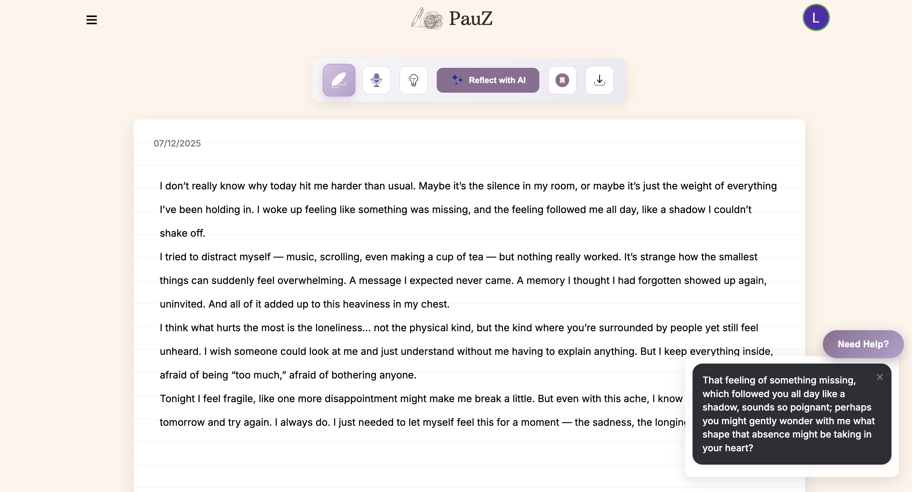
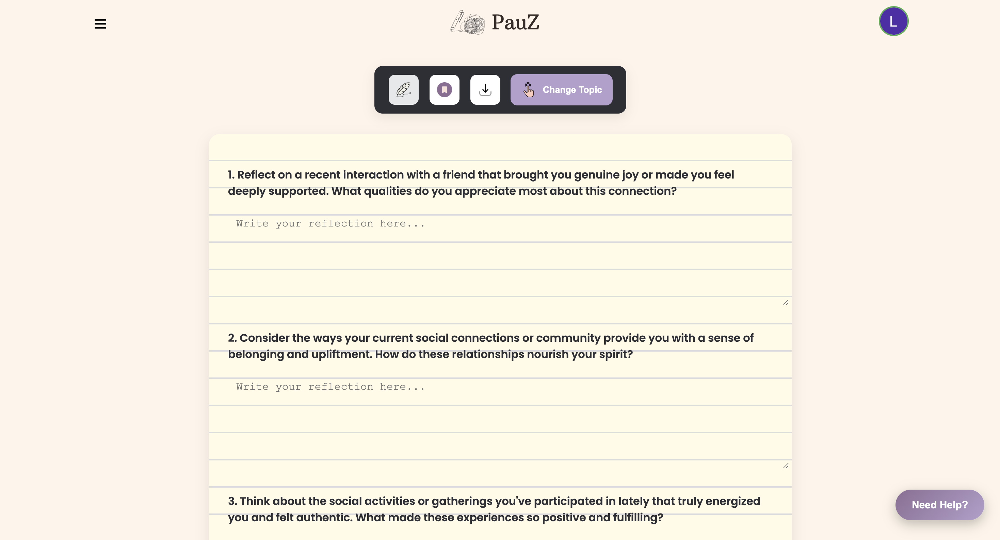
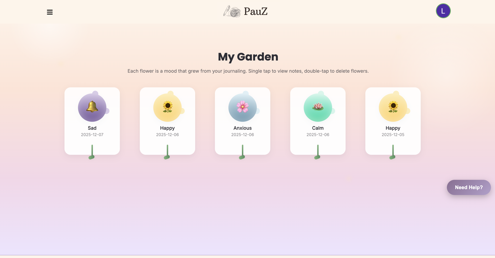
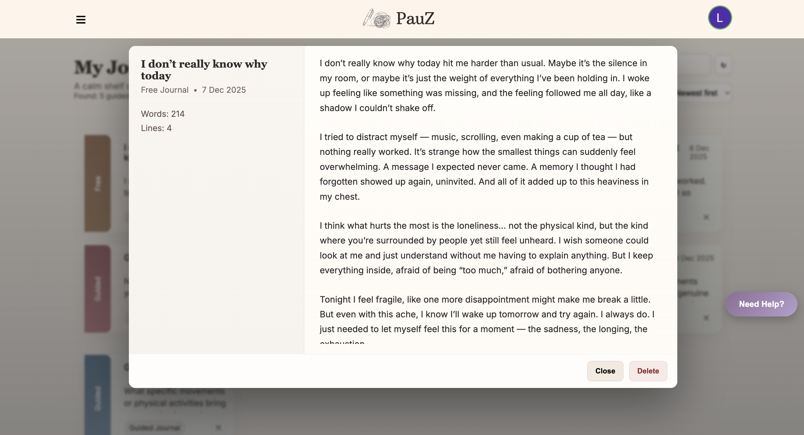
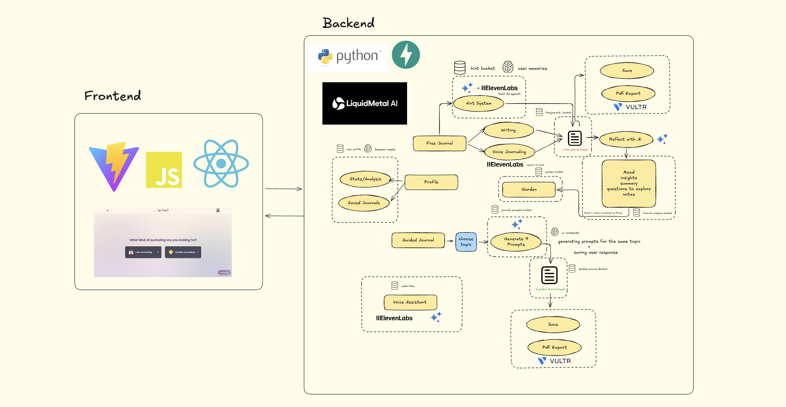

# 🌟 **PauZ** - Journaling AI Assistant

PauZ is an AI-driven journaling assistant designed to help you build a journaling habit, track your mood, and reflect on your emotional world. Leveraging LiquidMetal AI and Vultr technologies, PauZ provides free-form journaling, guided/prompts journaling, voice journaling, and mood tracking & analysis.





## 📖 **Table of Contents**

1. [Prerequisites](#prerequisites)
2. [Installation and Setup](#installation-and-setup)
3. [Usage](#usage)
4. [Built With](#built-with)
5. [License](#license)

---

## ✅ **Prerequisites**

Before running PauZ, ensure you have:

1.  **Python 3.10+**
2.  **pip** (Python package manager)
3.  A **Google API Key** for OAuth2
4.  **Vultr API keys** for storage
5.  **ElevenLabs API key** for voice journaling
6.  **Raindrop credentials** (organization, SmartBuckets, SmartMemory)
7.  **Google Gemini API key** for AI prompt generation

---

## 🛠️ **Installation and Setup**

### **Installation Steps**

1.  **Clone the Repository**

    ```bash
    git clone [https://github.com/Elby2112/pauz.git](https://github.com/Elby2112/pauz.git)
    cd pauz-backend
    ```

2.  **Install Python Dependencies**

    ```bash
    pip install -r requirements.txt
    ```

3.  **Configure Environment Variables**

    Create a `.env` file in the project root and add the following variables:

    ```env
    GOOGLE_CLIENT_ID=your_google_client_id
    GOOGLE_CLIENT_SECRET=your_google_client_secret
    REDIRECT_URI=your_redirect_uri
    VULTR_ACCESS_KEY=your_vultr_access_key
    VULTR_SECRET_KEY=your_vultr_secret_key
    VULTR_REGION=your_vultr_region
    VULTR_BUCKET_NAME=your_vultr_bucket_name
    ELEVENLABS_API_KEY=your_elevenlabs_api_key
    JWT_SECRET_KEY=your_jwt_secret
    JWT_ALGORITHM=HS256
    RAINDROP_ORG=your_raindrop_organization
    SMARTBUCKET_NAME=your_smartbucket_name
    APPLICATION_NAME=pauz-journaling
    AI_API_KEY=your_ai_api_key
    GEMINI_API_KEY=your_google_gemini_api_key
    ```

4.  **Run the Backend**

    ```bash
    uvicorn app.main:app --reload
    ```
    Backend will be available at: `http://127.0.0.1:8000`

5.  **Run the Frontend**

    ```bash
    cd pauz-frontend
    npm install
    npm run dev
    ```
    Frontend will run on the default Vite URL, usually `http://localhost:5173`

---

## 🚀 **Usage**

Once both frontend and backend are running:

* **Free Journaling:** Write freely or use AI-generated hints if stuck. Hints can also be read aloud with ElevenLabs voice.
* **Guided Journaling:** Choose a topic and get AI-generated prompts to reflect on.
* **Voice Journaling:** Speak your entries and let AI transcribe & analyze mood.
* **Mood Tracking (Garden):** Track your mood visually with flowers representing different emotions.
* **PDF Export:** Save and download your journal entries as PDFs.

---



## ⚖️ **License**

This project is licensed under the MIT License - see the `LICENSE` file for details.

## **Contact**

For any questions or feedback, please open an issue.
